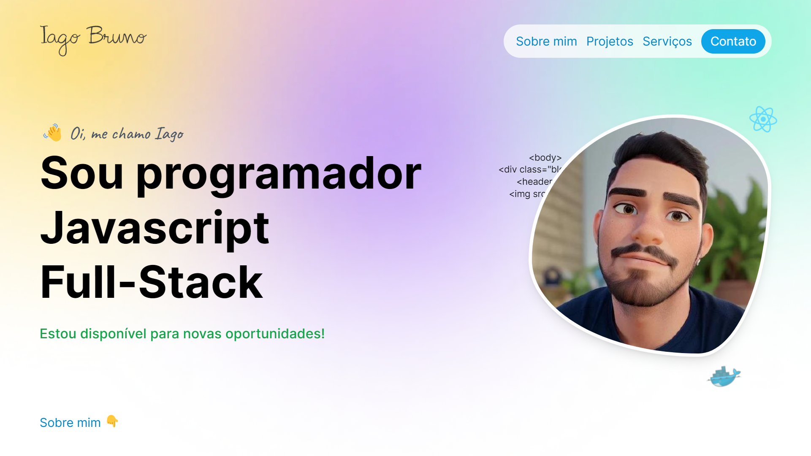

# [iagobruno.is-a.dev](https://iagobruno.is-a.dev)

My portfolio to present my work, skills and projects carried out.

[](https://iagobruno.is-a.dev)
[](https://github.com/iagobruno/iagobruno.dev/actions/workflows/deploy.yml)

[](https://iagobruno.is-a.dev)

## Built with

- React
- Next.JS
- TypeScript
- Tailwind CSS
- GitHub Pages + GH Actions

## Getting Started

First, run the development server:

```bash
npm run dev
# or
yarn run dev
# or
pnpm dev
```

Then open [http://localhost:3000](http://localhost:3000) with your browser to see the result.

## Hosting and deployments

The site is deployed to Github pages by an [action](/.github/workflows/deploy.yml) whenever new commits are pushed to the `main` branch.

The [is-a.dev](https://is-a.dev) service is used for custom domain.
