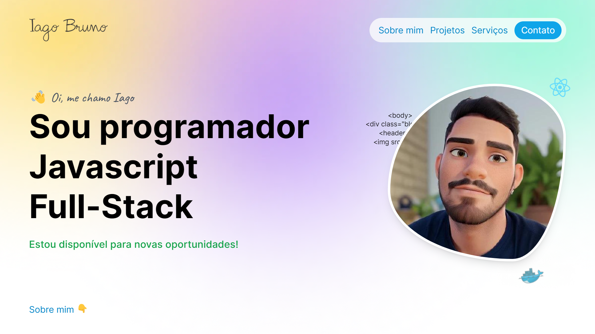

# [iagobruno.dev](https://iagobruno.dev)

Meu portfólio para apresentar meu trabalho, habilidades e projetos realizados.

[](https://iagobruno.dev)
[](https://github.com/iagobruno/iagobruno.dev/actions/workflows/deploy.yml)

[](https://iagobruno.dev)

## Construído com

- React
- Next.JS
- TypeScript
- Tailwind CSS
- MDX
- GSAP
- Bun
- GitHub Pages + GH Actions

## Estrutura do projeto

```
.
├── .github/workflows/   # Workflows do GitHub Actions para deploy automático
├── app/                 # Páginas e layouts do Next.js App Router
│   ├── (pages)/         # Sub páginas com roteamento agrupado
│   ├── layout.tsx       # Layout raiz da aplicação
│   ├── page.tsx         # Página inicial
│   ├── providers.tsx    # Providers (Theme, PostHog, etc)
│   └── globals.css      # Estilos globais e tema Tailwind
├── components/          # Componentes React reutilizáveis
├── hooks/               # Custom React hooks
├── lib/                 # Utilitários
├── public/              # Arquivos estáticos (imagens, favicons, etc.)
└── mdx-components.tsx   # Componentes customizados para MDX
```

> [Veja mais sobre](https://nextjs.org/docs/app/getting-started/project-structure) como funciona a estrutura de arquivos de apps Next.js.

## Como começar

```bash
cp .env.example .env
bun install
bun run dev
```

Depois abra [http://localhost:3000](http://localhost:3000) no seu navegador para ver o resultado.

## Hospedagem e deploy

O site é hospedado no Github Pages através de uma [action](/.github/workflows/deploy.yml) sempre que novos commits são enviados para o branch `main`.

O serviço [is-a.dev](https://is-a.dev) foi usado para o domínio personalizado.

## Licença

Propriedade privada - Todos os direitos reservados.
Mas sinta-se livre para estudar os códigos do projeto para se inspirar e criar o seu próprio portfólio.
